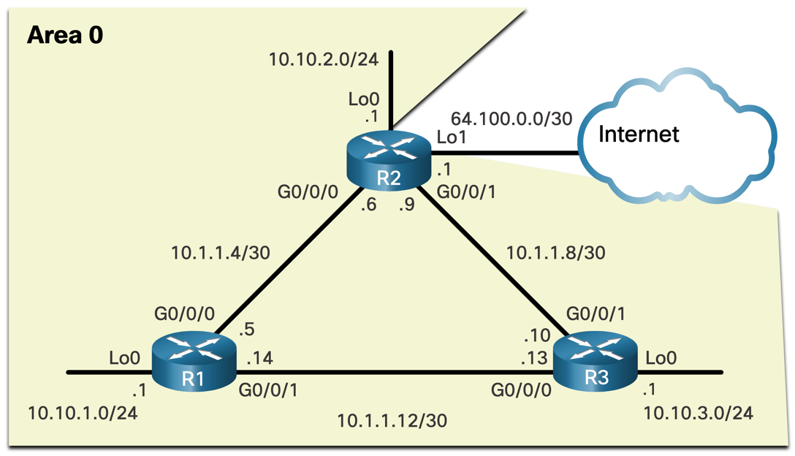

# OSPF Single-Area Router Configuration

## Basics of OSPF configuration
- The OSPFv2 is enabled using `router ospf process-id` command, where `process-id` is an integer from 1 to 65535. `process-id` is only locally significant.
> Best practice is to use the same `process-id` on all routers in the network to make management easy.

### Router ID
**Router ID** is a unique 32-bit number (formatted in the same way as IPv4 addresses) that identifies the router
in the OSPF domain. It is manually configured using the `router-id` command in the OSPF configuration mode.
> If not configured, the highest IP of any loopback interface is used, or IPv4 specifically configured on 
> any of the physical interfaces on the router is used as the router ID.

Router ID is used to elect the **DR** and **BDR** in multi-access networks. The router with the highest router ID
becomes the DR, and the router with the second-highest router ID becomes the BDR. These routers then manage the
synchronization of LSDBs with other routers in the network. Also, the router with the highest ID initiates DBD
packet exchange in Exchange state.

**Configuring a Loopback interface as the Router ID:**
- Enter an interface config mode `interface loopback 0`
- Configure the loopback IP address `ip address 1.1.1.1 255.255.255.255`

**Specifically configuring the Router ID:**
This is the preferred option.

- Enter the configuration mode.
- Enable OSPF using the `router ospf 10` command (process-id in this example is `10`).
- Set the router ID using the `router-id 1.1.1.1` command (router-id in this example is `1.1.1.1`).

> **Note:** If you are changing the router ID from some other previously configured value, it is necessary to clear the OSPF process using the `clear ip ospf process` command.

### Configuring OSPF network interfaces

After enabling the OSPF process, the next step is to configure the interfaces that will participate in the OSPF process.

- Enter the config-router mode using the `router ospf process-id` command.
- Use the `network` command to add all networks that we want to route using OSPF with `network network-address wildcard-mask area area-id` command.
- `network 10.10.1.0 0.0.0.255 area 0`
- `network 10.1.1.4 0.0.0.3 area 0`
- `network 10.1.1.12 0.0.0.3 area 0`

This adds the 3 network to the OSPF routing process (example for R1 from the scheme above).

> OSPF can also use exact interface IPv4 addresses instead of network addresses by using `0.0.0.0` wildcard mask.

> OSPF can also be configured directly from an interface
> - Enter the interface config mode using the `interface interface-type interface-number` command.
> - Use the `ip ospf process-id area area-id` command to enable OSPF on the interface.
> - For example: `interface g0/0/1`, `ip ospf 10 area 0`

### Passive interfaces

Passive interface does not send or receive OSPF Hello packets. Therefore, it does not form neighbour relationships with other routers on that interface.

- Enter the config-router mode using the `router ospf process-id` command.
- Use the `passive-interface interface-type interface-number` command to make the interface passive, for example `passive-interface g0/0/0`.
- To make all interfaces passive, use the `passive-interface default` command.

**`show ip protocols`** command can be used to check the list of interfaces configured as passive interfaces, alongside other OSPF configuration details.

### Point-to-Point OSPF networks
Even if there are only 2 routers on a network, DR and BDR are still elected by default. This can be avoided
by configuring the network as a point-to-point network.

- For each interface that is supposed to be point-to-point, enter the interface config mode.
- Use the `ip ospf network point-to-point` command to configure the interface as a point-to-point network.

