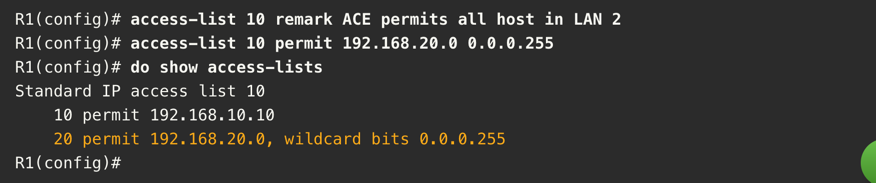

# ACL Concepts

**ACL** (Access Control List) is a sequential list of permit/deny statements used to filter packets based on their header
information. By default, routers don't have any ACLs configured and therefore all packets are permitted.

ACL consists of 1 or more **ACEs** (Access Control Entries, also referred to as *ACL statements*). ACEs are checked in sequence,
from top to bottom, and the first match is applied. This process is called **packet filtering**.

ACLs can:
- Limit network traffic to increase network performance
- Provide traffic flow control
- Provide basic level of security
- Filter traffic based on traffic type
- Screen hosts to permit/deny access
- Provide priority to certain types of traffic

Packet filtering can be done on:
- Layer 3 of OSI model (Network layer) - IP addresses, protocols, etc. (= *Standard ACLs*)
- Layer 4 of OSI model (Transport layer) - TCP/UDP ports, etc. (= *Extended ACLs*)

ACL is only applied to incoming and outgoing traffic, rules are not applied to traffic originating from the router itself.
Processing of inbound traffic is a little bit more efficient as the router doesn't have to route the packet before applying
the ACL (it gets discarded immediately).

### ACL wildcard traffic matching

**Wildcard mask** - Checks IPv4 address on binary level based on inverse of the IP (= wildcard).

> **Example of an ACL that only permits host with IPv4 address 192.168.1.1**
> 
> ... = ACL 10:
> `access-list 10 permit 192.168.1.1 0.0.0.0`
>> = Permitted IP `11000000.10101000.00000001.00000001` in binary mask form.

> We can also match for example whole /24 subnet by using a wildcard mask:
> 
> `access-list 10 permit 192.168.1.1 0.0.0.255`
> would match all IPs in `192.168.1.0-255`.

We can use alternative keywords to specify the mask:
- `host` - Specifies a single host = substitute for mask `0.0.0.0`
- `any` - Matches any IP address = substitute for mask `255.255.255.255`


### Guidelines for ACL creation

- Start with ACLs on security policies.
- Write down all the ACL requirements and targets they are supposed to achieve.
- Prepare ACLs in advance in a text editor, then copy-paste them into the router. (Save the configuration in text editor as well!)
- Document ACLs using `remark` command.
- Test the ACLs before production deployment.

> Entering ACLs directly can be risky, as a mistake can result in locking yourself out of the router, or for example
> cause a broadcast storm that can mess up other parts of the network and result in more required troubleshooting.


### Numbered vs Named ACLs

We can divide **numbered ACLs** into 2 categories:
- **Standard ACLs** - ACL with numbers from **1-99** and **1300-1999**. They filter based on source IP address only. They do not consider other
  parameters like destination address, protocol, or port numbers.
- **Extended ACLs** - ACL with numbers from **100-199** and **2000-2699**. They can include filtering based on protocols (TCP, UDP, ICMP...),
  port numbers and even certain flags.

Extended ACLs should be located as close to the source of traffic as possible, while standard ACLs should be located as close
to the destination as possible, to ensure maximum efficiency and good performance.

>Standard ACL example:
> 
>
>
>Extended ACL example:
> 
> 


**Named ACLs** are more flexible and easier to manage. They can be edited without changing the sequence number, and can be applied to
specific interfaces. They are also more descriptive and easier to understand. The `ip access-list` command is used to create named ACLs.


## Configuring ACLs on Cisco routers

### Syntax for numbered standard IPv4 ACL:

```Router(config)# access-list access-list-number {permit|deny|remark text} source [source-wildcard] [log]```

> `access-list-number` - Number of the ACL (1-99, 1300-1999).
> 
> `permit|deny` - Action to be taken if the packet matches the criteria.
> 
> `source` - Source IP address. It is possible to use `host` or `any` and omit the wildcard mask later.
> 
> `source-wildcard` - Wildcard mask for the source IP address. If omitted, the mask is assumed to be `0.0.0.0`.

It is possible to assign a name to the ACL by using the `ip access-list standard access-list-name` command.

**To apply the ACL to an interface:**

```Router(config-if)# ip access-group {access-list-number|access-list-name} {in|out}```

If we then wanted to remove it, we would use the `no` keyword in front of the command.


> **Example of a numbered standard ACL:**
> 
> 
> 

> **To debug, it is possible to use the output of show run command to see the configuration of the router.**
> 


### Creating named standard IPv4 ACLs
- Go to enable mode with `enable` command.
- Enter to global configuration mode with `configure terminal` command.
- Create named ACL group (for example with name *File_Server_Restriction*) with the `ip access-list standard File_Server_Restriction` command.
- Define ACEs for the ACL:
  - `permit host 192.168.20.4`
  - `permit host 192.168.10.100`
  - `deny any`
- Switch from global configuration mode to interface configuration mode with `interface interface_name` command.
- Apply the ACL to an interface with the `ip access-group File_Server_Restriction in` command.

> **Remember:** We are trying to apply the ACL to interface that is the most effective and suitable.
> Since we want to restrict the access to the file server, it makes sense to put in on outgoing interface of R1, that leads towards S3.
> 
>

## Modifying existing ACLs

As ACLs with many ACEs can get quite overwhelming, there are 2 main methods of modifying ACLs that try to minimize error and
make the process as easy as possible.

### Text editor method
- First, fetch the current configuration with `show run | section access-list` from the enable mode of target router.
- Copy the contents to a text editor, edit it as needed.
- Remove the current ACL configuration on the router.
- Paste in new configuration into the router from your text editor.

### Sequence number method
- Start by printing out the current configuration.
> Sample output, there is a mistake in ACE 10 - it should say 192 instead of 19.
> 
> 

- Enter the global configuration mode and enter the ACL configuration mode with `ip access-list standard 1` command.
- Use the `no` command to remove the ACE with the wrong sequence number: `no 10`.
- Add the correct ACE with the correct sequence number: `10 deny host 192.168.10.10`
- Exit the ACL configuration mode with `end` command.

> 


## Securing VTY ports with ACL

ACLs can be used to secure VTY ports on a router. This can be useful to prevent unauthorized access to the router.
To make it happen, we can use the `access-class` command in line configuration mode.


Please, note that telnet is just for purposes of demonstration, in production environment, it is recommended to use SSH instead.
We would use `transport input ssh` command to enable SSH on the VTY lines.

We can verify the configuration using `show access-lists` command.