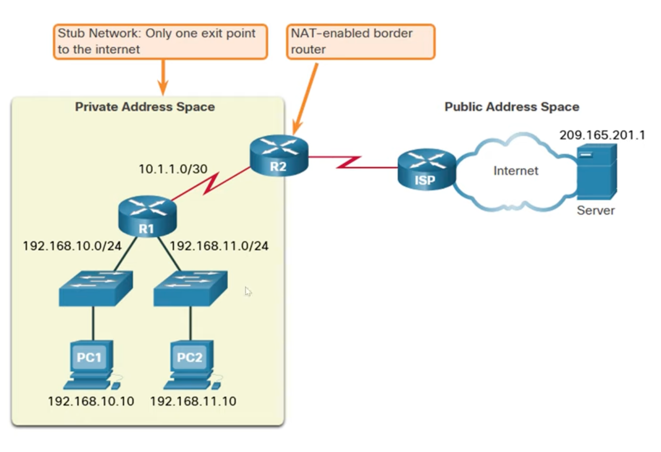
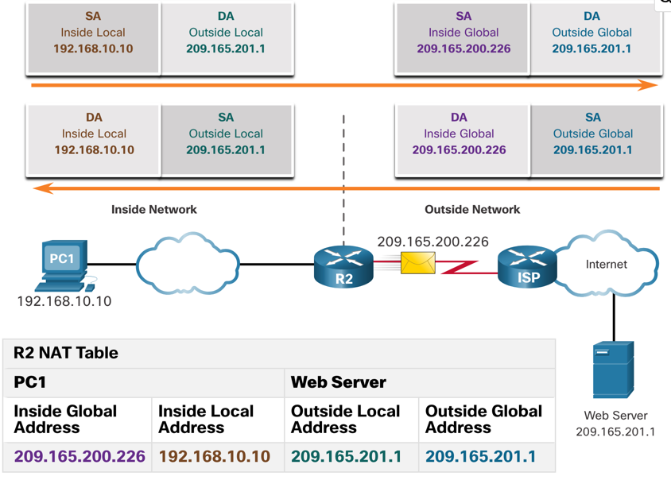
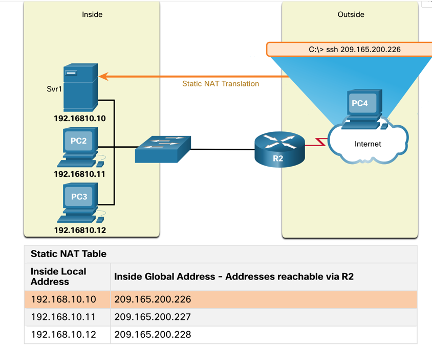
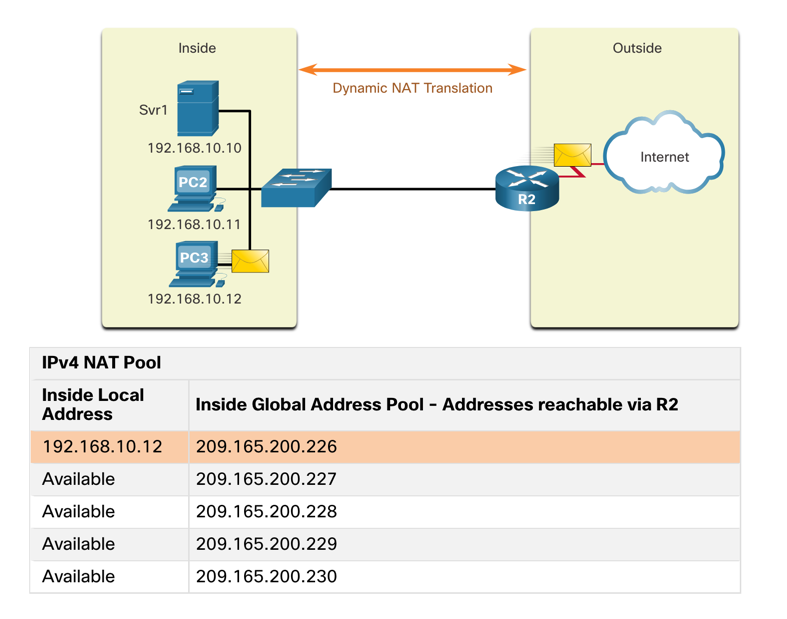
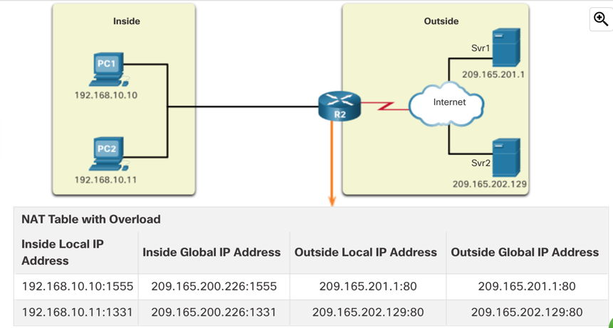
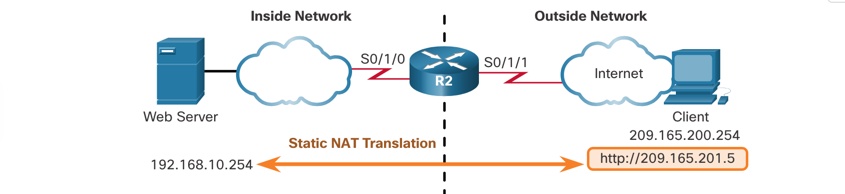
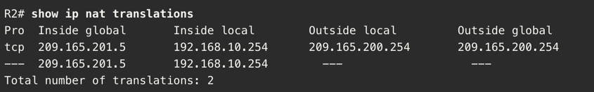
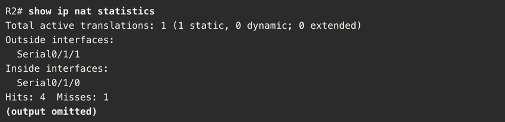
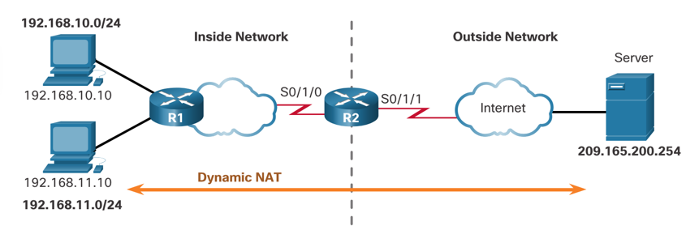
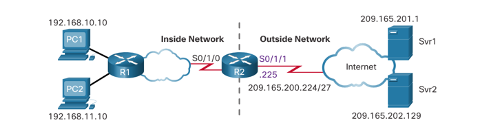

# NAT for IPv4

NAT = Network Address Translation

It is used to translate private IP addresses to public IP addresses and vice versa. It conserves public IP addresses and to provides security by hiding the internal network structure.

NAT-enabled routers typically operate on the border between private and public network.



> **RFC 1918 - Private Address Space**
>
>| Class | Address range           | Prefix |
>|-------|-------------------------|--------|
>| A     | 10.0.0.0 - 10.255.255.255 | /8     |
>| B     | 172.16.0.0 - 172.31.255.255 | /12    |
>| C     | 192.168.0.0 - 192.168.255.255 | /16    |


### How NAT works

Router with NAT has a **NAT table** that maps private IP addresses to public IP addresses. When a packet comes from the
private network, the router translates the source IP address to a public IP address from the NAT table. When a packet
comes from the public network, the router translates the destination IP address to a private IP address from the NAT table.



### Types of NAT

- **Static NAT** - One-to-one mapping of local IP address to global IP address. It is used when a device needs a
constant address (eg. when it needs to be long term accessible from outside the network - web servers etc.).

> **Sample Static NAT** 
> 
>

- **Dynamic NAT** - Uses a pool of public addresses, assigns them on a first-come-first-serve basis. It is used when a
limited number of public IP addresses are available.

> **Sample Dynamic NAT**
> 

When a pool is depleted, all users that can't get a public IP address are denied access to the internet, until one of the current users releases their IP address.

- **PAT (Port Address Translation) ("NAT Overload")** - Maps multiple private IP addresses to a single public IP address using different ports.
It is used when a large number of private IP addresses need to access the internet.

> **Example of PAT.** Both inside hosts use the same IP address to communicate with two different addresses in the internet.
> 
> 
> When using PAT, the router tries to always preserve the inside local-global port number. However, if the port number is
> already used by another session, it will get changed to any free port number in the range 1024-65535. When response is received,
> it gets translated back to the original port number.


The main difference between NAT and PAT therefore is, that PAT also keeps track of the port numbers, which enables it to map
multiple private IP addresses to a single public IP address simultaneously.

For packets without Layer 4 information (like ICMP), PAT uses the session number to keep track of the session.

### Advantages of NAT

- Conserves public legally registered addressing scheme by allowing privatization of intranets.
- Allows to pool and load balance to ensure reliable public network connections.
- Provides consistency for internal network addressing, regardless of the ISP.
- Using RFC 1918 addresses, it can be used to hide the internal network structure. (Firewall is however the true security device, not NAT.)

### Disadvantages of NAT

- Performance loss due to translation.
- Forwarding delays as public addresses are depleted and ISPs are assigning private addresses to customers, creating a double (or more) translation.
- Loss of end-to-end IP traceability.
- Applications that embed IP addresses in the data payload may not work with NAT.
- Complication for tunneling protocols such as IPsec, as NAT changes the IP header, which can break the tunnel.

---

### NAT64

NAT64 is a mechanism to allow IPv6 hosts to communicate with IPv4 servers.

Ideally, **IPv6 should be run natively where possible**. However, in cases where IPv4 is still required, NAT64 can be used to
encapsulate IPv6 packets into IPv4 packets.

This should not be a long term strategy, but can be used to assist in the transition from IPv4 to IPv6.

---

## NAT Configuration

### Static NAT

The syntax of command to configure static NAT is:

```Router(config)# ip nat inside source static local-ip global-ip```

- `inside`/`outside` - Interface where the local/global IP address is located.
- `local-ip` - Local IP address to be translated.
- `global-ip` - Global IP address to be translated to.

> **Example of Static NAT configuration:**
> 
> 
> 
> **Step 1:** Create a mapping between the local and global address.
> - `ip nat inside source static 192.168.10.254 209.165.201.5`
> 
> **Step 2:** Apply the NAT configuration to the interface.
> - `interface s0/1/0`
> - `ip address 192.168.1.2 255.255.255.252`
> - `ip nat inside`
>
> 
> - `interface s0/1/1`
> - `ip address 209.165.200.1 255.255.255.252`
> - `ip nat outside`


**Verification of NAT configuration:**
- `show ip nat translations` - Shows the NAT translations.
- `show ip nat statistics` - Shows the NAT statistics.

>
> 
>

---

### Dynamic NAT Configuration

Unlike in static NAT, in dynamic NAT, the global IP address is not statically defined. Instead, a pool of global IP addresses is used.

> **The configuration of a dynamic NAT is a multi-step process:**
> 
> 
> 
> - **Step 1:** Create an access list that defines the local IP addresses that will be translated: `ip nat pool NAT-POOL1 209.165.200.226 209.165.200.240 netmask 255.255.255.224`
> - **Step 2:** Prepare ACL that permits only addresses that are to be translated: `access-list 1 permit 192.168.0.0 0.0.255.255`
> - **Step 3:** Create a NAT statement that binds the ACL to the NAT pool: `ip nat inside source list 1 pool NAT-POOL1`
> - **Step 4:** Apply the NAT configuration to inside interface: `interface s0/1/0` `ip nat inside`
> - **Step 5:** Apply the NAT configuration to outside interface: `interface s0/1/1` `ip nat outside`

By default, the NAT translations will time out after 24 hours. This can be changed with the `ip nat translation timeout timeout-in-seconds` command.

Assigned entries can also be invalidated using the `clear ip nat translation *` command, or individually by `clear ip nat translation inside global-ip local-ip`.

**Verification of NAT configuration:**

- `show ip nat translations` - Shows the NAT translations.
- `show ip nat translation verbose` - Shows additional information about the NAT translations, such as timeouts.
- `show ip nat statistics` - Shows the NAT statistics.

---

### PAT Configuration

In the PAT configuration we just add `overload` keyword:

```Router(config)# ip nat inside source list access-list-number interface type overload```

We can configure PAT either to use a **single public IP address** or a **pool of public IP addresses**.

> **Example of PAT configuration:**
> 
> For single public IP address:
> 
> - `ip nat inside source list 1 interface s0/1/1 overload`
> - `access-list 1 permit 192.168.0.0 0.0.255.255`
> - `interface s0/1/0`
> - `ip nat inside`
> - `interface s0/1/1`
> - `ip nat outside`
> 
> Or for a pool of public IP addresses:
> 
> 
> 
> - `ip nat pool NAT-POOL2 209.165.200.226 209.165.200.240 netmask 255.255.255.224`
> - `access-list 1 permit 192.168.0.0 0.0.255.255`
> - `ip nat inside source list 1 pool NAT-POOL2 overload`
> - `interface s0/1/0`
> - `ip nat inside`
> - `interface s0/1/1`
> - `ip nat outside`

Again, we can **verify** the configuration:
- `show ip nat translations` - Shows the NAT translations.
- `show ip nat statistics` - Shows the NAT statistics.
