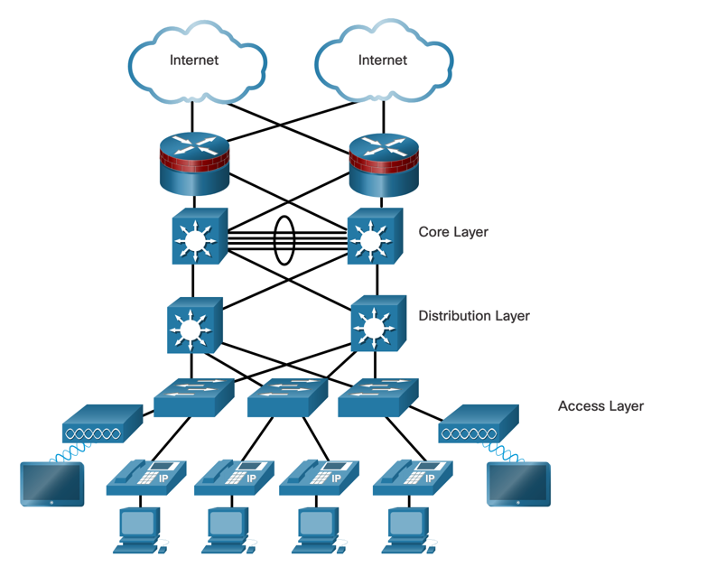
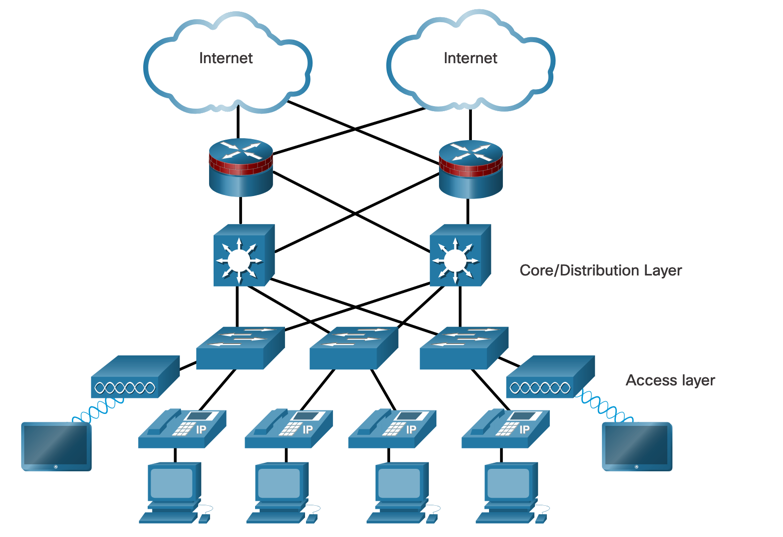
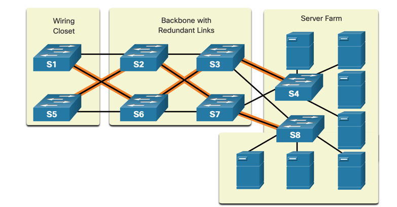
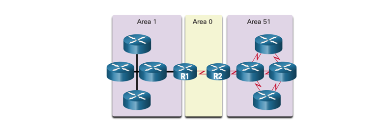
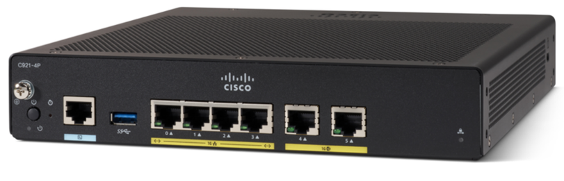
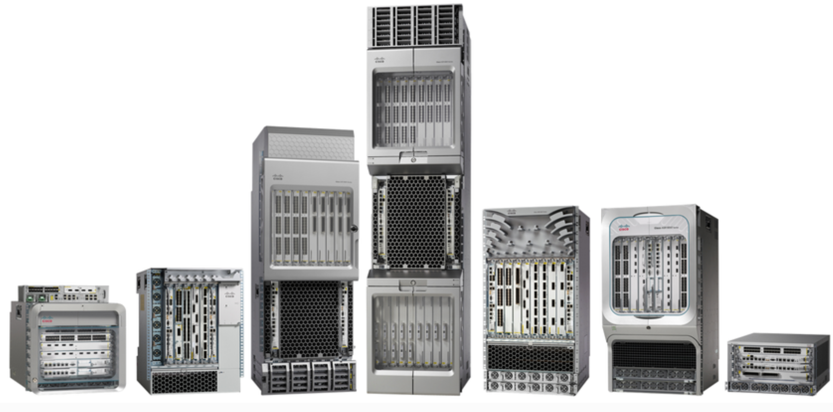
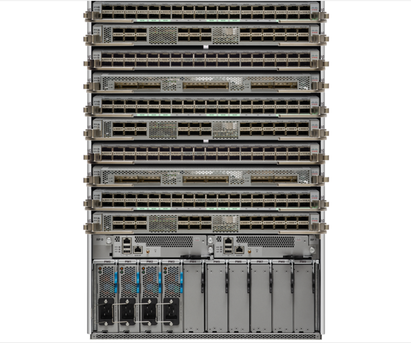

# Network Desing

## Hierarchical Network Design

These days, networks must support various types of network traffic. They are required to

- Support critical application
- Support converged network traffic
- Support diverse business needs
- Provide centralized administrative control

With the increasing demand, it is good to have an architectural approach that simplifies the network management and makes
the network scalable for future demand.

**Hierarchical Borderless Network Design** is a network design that aims to provide:

- Hierarchical design - each device at every tier has certain role.
- Modularity - allows for easy expansion on on-demand basis.
- Resiliency - satisfies the need for high availability.
- Flexibility - allows for traffic load sharing and redundancy.

It is usually built as 3-tier or 2-tier design.

> **3-Tier Design**
> 
> 
> 
> **2-Tier Design**
> 
> 

**Access Layer** represents the network edge, where traffic enters or exits the network from end-devices.

**Distribution Layer** interfaces between access and core layer and provides: 

- Aggregation of access layer devices,
- Aggregation of Layer 2 broadcast domains and Layer 3 routing boundaries.
- Provides intelligent services such as QoS, security, and policy-based connectivity.
- Guarantees high availability through redundant distribution layers.

**Core Layer** is the backbone of the network. It aggregates all the distribution layer devices and ties the campus
network together with the rest of the network. It is responsible for transporting large amounts of data quickly.

3-tier networks are usually used in large networks (eg. multiple buildings), while 2-tier networks are used in smaller networks
as they are easier to manage and require less hardware by collapsing the Distribution/Core layers (eg. 1 building).

## Scalable Networks

When building networks with scalability in mind, it is important to consider the following:

- **Redundant Links**: Provide multiple paths for data to travel. This ensures that if one link fails, the data can still
  reach its destination. Remember, to prevent L2 loops, this requires STP.

- **Multiple Links**: The goal should be to increase bandwidth as much as possible. This can either be dan with EtherChannel
or equal-cost load balancing. EtherChannel can be a cost-effective alternative to high-speed interfaces and fiber runs.

- **Failure domain size**: The size of the failure domain should be kept small. This is the area that is affected by a single
piece of equipment failing. The smaller the failure domain, the less impact a failure will have on the network.

Routers and switches are usually deployed in pairs on critical network segments to provide redundancy.

- **Scalable routing protocol**: It is important to implement features within routing protocol to isolate routing updates
and minimize the sizes of routing tables.

- **Wireless Connectivity**: Wireless connectivity is important to allow for mobility and expansion.

## Switch Hardware

**Cisco switch series:**
- Campus LAN Switches - core, distribution, access and compact switches - Cisco 2960, 3560, 3750, 4500, 6500, 6800... series.
- Cloud Managed Switches - Cisco Meraki series.
- Data Center Switches - Cisco Nexus series.
- Service Provider Switches - Cisco ASR 9000 series.
- Virtual Networking - Cisco Nexus 1000V series.

**Switch Features, Considerations for switch selection:**
- **Port density**: The number of ports on a switch.
- **Forwarding rate**: The rate at which a switch can process packets (100Mbps, 1Gbps, 10Gbps, 40Gbps, 100Gbps).
- **Power over Ethernet (PoE)**: Allows the switch to provide power to devices connected to it.
- **Multilayer switching**: The ability to switch packets at Layer 3 and therefore also route (build own routing table).
- **Price**: The cost of the switch.
- **Frame buffer size**: The amount of memory the switch has to store frames.

## Router Hardware

**Cisco router series:**
- Branch Routers - Cisco 1900, 2900, 3900, 4000... series.
- Network Edge Routers - Cisco 7200, 7600, ASR 1000, ASR 9000 series.
- Service Provider Core Routers - Cisco CRS-1, CRS-3, NCS 6000 series.
- Industrial Routers - Cisco 800, 1100 series.

> **Cisco router form factors**
> 
> Cisco 900 series - small form factor for branch offices.
> 
> 
> 
> Cisco ASR 9000 series - aggregation services routers for network edge.
> 
> 
> 
> Cisco CNS 5500 series - datacenter and large enterprise core routers.
> 
> 

