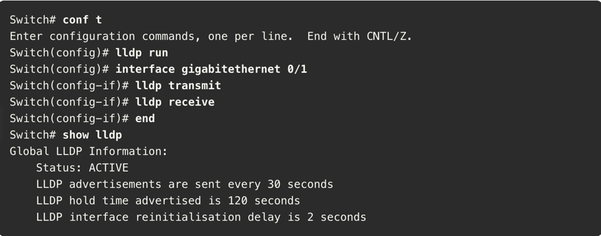
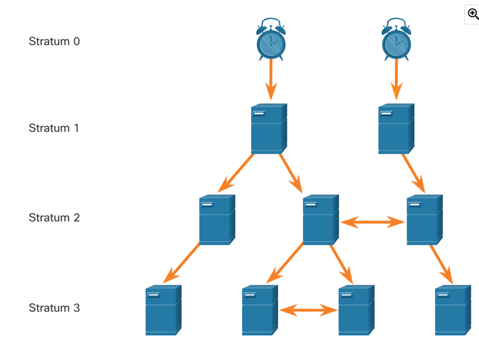

# Network management

## CDP (Cisco Discovery Protocol)

CDP is a proprietary Layer 2 protocol that used to gather information about Cisco devices that share the same data link.

Each device is sending periodic advertisements to connected devices. They contain information such as name of the device,
number and type of interfaces etc.

### CDP configuration

Info about the CDP can be displayed with the `show cdp` command.

To enable CDP for all interfaces, use the `cdp run` command in global configuration mode. To disable it, use `no cdp run`.

CDP can also be enabled only on specific interfaces with the `cdp enable` command in interface configuration mode. To display
which interfaces have CDP enabled, use the `show cdp interface` command.

Neighbor devices can be displayed with the `show cdp neighbors` command or `show cdp neighbors detail` for more information.

> **CDP detail output:**
> 
> 

## LLDP (Link Layer Discovery Protocol)

LLDP is an open standard Layer 2 protocol that is similar to CDP. Unlike CDP, it is not Cisco proprietary and can be used on
non-Cisco devices as well.

### LLDP configuration

To verify whether LLDP is enabled, use the `show lldp` command. To enable it, use the `lldp run` command in global configuration.

LLDP can be enabled on specific interfaces with the `lldp transmit` and `lldp receive` commands in interface configuration mode.

> **LLDP configuration:**
> 
> 

To discover neighbors, use the `show lldp neighbors` command, or `show lldp neighbors detail` for more information.

## NTDP (Network Time Protocol)

Device time should be synchronized across the network, to ensure that logs and timestamps are accurate and that it is 
possible to determine the sequence of events.

To provide automatic synchronization, the Network Time Protocol (NTP) is used. It uses UDP port 123.

NTP uses hierarchical system of time sources.

The most accurate time sources are called **stratum 0** devices - such as atomic clocks. Stratum 1 devices are usually authoritative
time sources and standard for stratum 3 and lower time sources. The maximum hop count for NTP is 15, **stratum 16 would indicate that
the device is not synchronized.**

### NTP configuration

To verify the current time configuration, use the `show clock detail` command.

NTP can be configured with the `ntp server ntp-server-ip` command in global configuration mode. To verify the NTP configuration, use the `show ntp associations`.

Details about the NTP configuration can be displayed with the `show ntp status` command.
