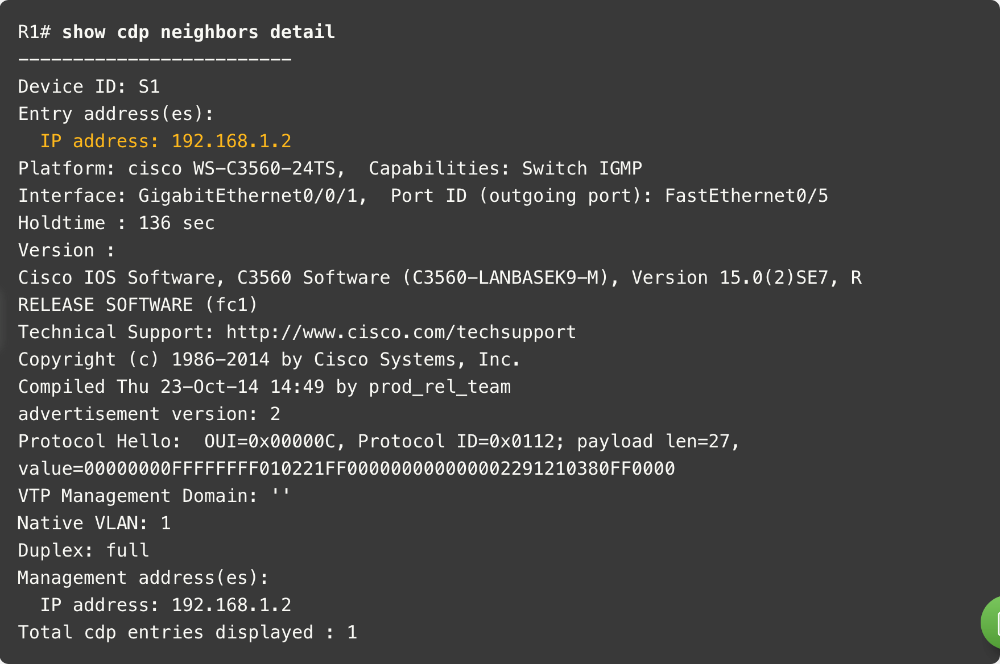

# Network management

## CDP (Cisco Discovery Protocol)

CDP is a proprietary Layer 2 protocol that used to gather information about Cisco devices that share the same data link.

Each device is sending periodic advertisements to connected devices. They contain information such as name of the device,
number and type of interfaces etc.

### CDP configuration

Info about the CDP can be displayed with the `show cdp` command.

To enable CDP for all interfaces, use the `cdp run` command in global configuration mode. To disable it, use `no cdp run`.

CDP can also be enabled only on specific interfaces with the `cdp enable` command in interface configuration mode. To display
which interfaces have CDP enabled, use the `show cdp interface` command.

Neighbor devices can be displayed with the `show cdp neighbors` command or `show cdp neighbors detail` for more information.

> **CDP detail output:**
> 
> 

## LLDP (Link Layer Discovery Protocol)

LLDP is an open standard Layer 2 protocol that is similar to CDP. Unlike CDP, it is not Cisco proprietary and can be used on
non-Cisco devices as well.

### LLDP configuration

To verify whether LLDP is enabled, use the `show lldp` command. To enable it, use the `lldp run` command in global configuration.

LLDP can be enabled on specific interfaces with the `lldp transmit` and `lldp receive` commands in interface configuration mode.

> **LLDP configuration:**
> 
> 

To discover neighbors, use the `show lldp neighbors` command, or `show lldp neighbors detail` for more information.

## NTDP (Network Time Protocol)

Device time should be synchronized across the network, to ensure that logs and timestamps are accurate and that it is 
possible to determine the sequence of events.

To provide automatic synchronization, the Network Time Protocol (NTP) is used. It uses UDP port 123.

NTP uses hierarchical system of time sources.

The most accurate time sources are called **stratum 0** devices - such as atomic clocks. Stratum 1 devices are usually authoritative
time sources and standard for stratum 3 and lower time sources. The maximum hop count for NTP is 15, **stratum 16 would indicate that
the device is not synchronized.**

### NTP configuration

To verify the current time configuration, use the `show clock detail` command.

NTP can be configured with the `ntp server ntp-server-ip` command in global configuration mode. To verify the NTP configuration, use the `show ntp associations`.

To declare current device as an authoritative NTP server, use the `ntp master stratum-level` command in global configuration mode.

Details about the NTP configuration can be displayed with the `show ntp status` command.

## SNMP (Simple Network Management Protocol)

SNMP is a Layer 7 protocol that is used to manage and monitor network devices. It is used to collect information about devices,
configure devices, and receive notifications about events.

It consists of three main components:

- **SNMP manager** - the system that is used to manage the devices.
- **SNMP agent** - the software that runs on the managed device and collects information.
- **MIB (Management Information Base)** - the database that contains information about the managed device.

SNMP manager can collect information about agents using the `GET` request, configure agents using the `SET` request, and receive
notifications from agents using the `TRAP` request.

SNMP agent and MIB are run on client devices, such as switches, routers, firewalls etc.

SNMP uses UDP port 161 for sending requests and 162 for receiving traps.

**SNMP Operations:**

- **get-request** - retrieves a value from a specific variable.
- **get-next-request** - retrieves the next value in the MIB.
- **get-bulk-request** - retrieves multiple values in a single request.
- **get-response** - response to a get-request.
- **set-request** - sets a value in the MIB.

**SNMP Agent Traps:**

Instead of having NMS to periodically poll all devices, which can be resource-intensive, SNMP agents can send traps to the NMS
when a specific event occurs.

**SNMP Versions:**

- **SNMPv1** - the first version of SNMP, which is not secure and sends data in clear text.
- **SNMPv2c** - an updated version of SNMPv1, which adds support for 64-bit counters and basic community string match for authentication.
- **SNMPv3** - the most secure version of SNMP, which adds encryption and secure authentication.

**SNMP Community Strings:**

To prevent malicious users from accessing SNMP data, community strings can be used. There are two types of community strings:

- **Read-only (RO)** - allows the NMS to read information from the agent.
- **Read-write (RW)** - allows the NMS to read and write information to the agent.

Basically, when NMS sends a request to the agent, it includes the community string. If the string matches the one configured on the agent,
the request is processed. If the string does not match, the request is dropped on the device that is being analyzed.

**MIB Structure:**

MIB is organized hierarchically, in a tree-like structure. Each node in the tree is called an **object identifier (OID)**.

> **Usage of SNMP polling to monitor CPU utilization:**
> 
> 
> 
> We can monitor the usage and if it exceeds certain threshold, send a notification. The data can be retrieved
> using the `snmpget` utility.
> 
> 

**SNMP Object Navigator:**

SNMP Object Navigator is a tool created by cisco to simplify the process of monitoring devices using SNMP. It offers
a GUI where it is possible to search for specific OIDs/object names and get information about them.

## Syslog

Syslog protocol was designed to ensure ou can receive and understand messages from network devices to identify issues.
It enables to select type and level ov logging, as well as destinations of the captured syslog messages.

Syslog uses UDP port 514. It is supported on most network devices, such as routers, switches, firewalls etc.

**Syslog Operation:**

Syslog messages can be sent to a various destinations, such as:

- Logging buffer
- Console line
- Terminal line
- Syslog server

It is possible to view them both locally and remotely.

**Syslog message fromat:**

In addition to specifying severity, syslog messages also contain information about the facility that generated the message.

Common facility codes include:

- IF - Message generated by an Interface
- IP - Message generated by an IP
- SYS - Message generated by the System
- OSPF - Message generated by OSPF
- IPSec - Message generated by IPSec
- ...

> **Syslog output naming convention:**
> 
> `%facility-severity-MNEMONIC: description`
> 
> In this example:
> 
> `%LINK-3-UPDOWN: Interface Port-channel1, changed state to up`
> 
> LINK is the facility, 3 is the severity, and UPDOWN is the mnemonic.

### Configuring Syslog

Here is an example of forcing log to display time and date of logged events.

## Cisco Router and Switch Maintenance

### Router file systems

Cisco IOS uses IFS (IOS File System) that allows the administrator to navigate the file system and manage files.

To display the basic info about it, such as total and free memory, file system type and permissions,
use the `show file systems` command.

To display the contents of the file system, use the `dir` command.

To view nvram contents, it is first necessary to change the directory to nvram, using the `cd nvram:` command. You can 
view your present working directory using the `pwd` command.

> 

### Configuration backup

It is possible to use TFTP (Trivial File Transfer Protocol) to back up the configuration of the device.

To do so, use the `copy running-config tftp` command. You will be prompted to enter the IP address of the TFTP server
and the name of the file to save the configuration to. It is also possible to copy the startup configuration to the TFTP server
using the `copy startup-config tftp` command.

To restore the configuration, use the `copy tftp running-config` command.

### USB ports on Cisco devices 

Connect your USB to the device. List out available locations using the `show file systems` command.

You should be able to see and cd into the USB using the `cd usbflash0:` command. It is then possible to copy files to and
from the USB (`copy running-config usbflash0:`...).

It is also possible to use `more` command to preview the contents of the file.

### Password recovery procedure

- Enter the ROMMON mode by restarting the device and pressing `Ctrl + Break` during the boot process. When successful, you should
see the `rommon 1>` prompt.
- Change the configuration register value to ignore the startup configuration by using the `confreg 0x2142` command.
- Restart the device using the `reset` command.
- Enter the privileged exec mode by using the `enable` command.
- Copy the startup configuration to the running configuration using the `copy startup-config running-config` command. This will
erase the original configuration.
- Change the password using the `configure terminal` and `enable secret your-password` commands.
- Change the configuration register value back to the original value using the `confreg 0x2102` command.
- Save the new configuration using the `copy running-config startup-config` command.
- Restart the device using the `reload` command.

### IOS image management

TFTP servers are a recommended IOS image backup and upgrade storage solution. To copy the IOS image to the TFTP server, use the
`copy flash: tftp:` command. To copy the IOS image from the TFTP server to the device, use the `copy tftp: flash:` command.

To upgrade the IOS image, use the `boot system flash:filename` command in global configuration mode. To verify the current IOS image,
use the `show version` command.

