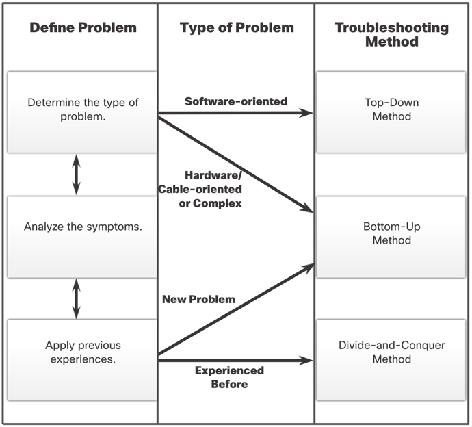

# Network troubleshooting

## Documentation

When troubleshooting a network, it is important to have proper documentation. This includes:

- Network physical topology diagrams (device names, locations, interfaces used, types of connections etc.)
- Network logical topology diagrams (Device identifiers, IP addressing, VLANs, protocols used etc.)

For each device, we should also have the following information:

- Routers/Switches: Documentation of each interface, IP address, subnet mask, and routing protocols used. Model of the device, version
of operating system, licenses and access information.
- End-Devices (servers etc.): Device model, OS, Services being hosted. MAC and IP addresses, default gateway and DNS server information.

## Network baseline

We should always try to see:

- How does the network perform under normal conditions?
- Where are the errors most commonly occurring?
- What part of network is most heavily used?
- Which part of network is not as heavily used?
- Which devices should have error alerts configured and what should be the threshold?
- Can the network meet the identified policies?

We can monitor the network using various tools and across different time periods to get a better understanding of the network.

## Troubleshooting steps

When troubleshooting a network, we should follow these steps:

1. **Define the problem**: What is the problem? What are the initial symptoms? Where did it start? What is the scope of the problem?
2. **Gather information**: Collect information about the problem. This includes logs, network diagrams, and any other relevant information.
3. **Analyze the information**: Look at the information you have gathered and try to identify the root cause of the problem.
4. **Eliminate potential causes**: Once you have identified the root cause, try to eliminate other potential causes of the problem.
5. **Propose a hypothesis**: Based on the information you have gathered, propose a hypothesis about what is causing the problem.
6. **Test the hypothesis**: Test your hypothesis to see if it is correct. This may involve making changes to the network configuration or running diagnostic tests.
7. **Implement a solution**: Once you have identified the root cause of the problem, implement a solution to fix it.

### Questioning end users

End users often provide vague or misleading information about problems.

Try asking specific questions:

- "What does not work?"
- "Where is the problem?"
- "When does the problem occur?"
- "Were there any errors displayed, when as the problem first noticed?"
- "What has changed recently?"
- "Can you reproduce the problem?"
- "Can you send screenshots or video?"
- Or eliminate the problem by asking "What does work?"

### Structured troubleshooting methods.

We can take many approaches:

- **Top-down**: Start at the application layer and work down to the physical layer.
- **Bottom-up**: Start at the physical layer and work up to the application layer.
- **Divide and conquer**: Divide the network into smaller parts and troubleshoot each part separately.
- **Follow the path**: Follow the path of the data through the network to identify where the problem is occurring.
- **Substitution**: Replace components of the network to see if the problem is resolved.
- **Compare configurations**: Compare the configuration of the network to a known good configuration to identify differences.
- **Educated guess**: Use your knowledge of the network to make an educated guess about what is causing the problem.

> 

### Troubleshooting tools

There are many tools available to help troubleshoot network problems. Some common tools include:

- **Protocol analyzers**: Tools that capture and analyze network traffic to identify problems. (eg. Wireshark)
- **Hardware diagnostic tools**: Tools that test the hardware components of a network device to identify problems. (eg. multimeters, cable testers, Cisco Prime NAM)
- **Monitoring tools**: Tools that monitor the performance of a network to identify problems. (eg. SNMP, NetFlow, Syslog)

### Common network problems

**Physical layer problems and their symptoms**:

- Performance issues: Slow network speeds, dropped packets, high latency.
- Connectivity issues: Intermittent connectivity, no connectivity.
- High error rates: CRC errors, late collisions, runts, giants.
- High utilization: Network congestion, bandwidth saturation.
- Console errors: Error messages on the console of a network device.

Common causes:

- Bad cables: Damaged cables, loose connections, incorrect cable type.
- Bad connectors: Damaged connectors, dirty connectors, incorrect connector type.
- Power issues: Power supply failure, power surge, power outage.
- Attenuation: Signal loss over long cable runs, signal loss due to interference.
- Exceeding design limits: Exceeding the maximum cable length, exceeding the maximum number of devices on a segment.

**Data link layer problems and their symptoms**:

- Performance issues: Slow network speeds, dropped packets, high latency.
- Excessive broadcasts: Broadcast storms, MAC address table overflow.
- Console errors: Error messages on the console of a network device.

Common causes:

- Encapsulation errors: Incorrect encapsulation type, mismatched encapsulation types.
- Addressing errors: Incorrect MAC address, incorrect IP address, incorrect subnet mask.
- Framing errors: Incorrect frame size, incorrect frame type, incorrect frame check sequence.
- STP failures: STP convergence issues, STP misconfiguration, STP loops.

**Network layer problems and their symptoms**:

- Performance issues: Slow network speeds, dropped packets, high latency.
- Network failures: Routing failures, routing loops, routing black holes.

Common causes:

- Connectivity issues: Check lower layers for connectivity issues.
- Routing issues: Routing protocol failures, routing table errors, routing protocol misconfigurations.
- Neighbor issues: Neighbor relationship failures, neighbor relationship flapping, neighbor relationship misconfigurations.

**Transport layer problems and their symptoms**:

- Connectivity issues: Intermittent connectivity, no connectivity.
- Access issues: Access denied errors, access control list failures, access control list misconfigurations.

Common causes:

- Misconfigured ACLs: Incorrect ACL entries, incorrect ACL order, incorrect ACL placement.
- Misconfigured NAT: Incorrect NAT translations, incorrect NAT rules, incorrect NAT interfaces.

**Application layer problems and their symptoms**:

... varies depending on the application.

