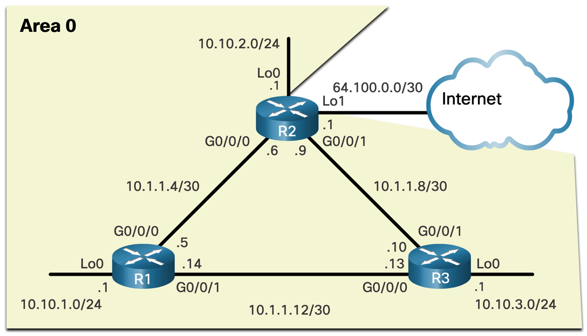
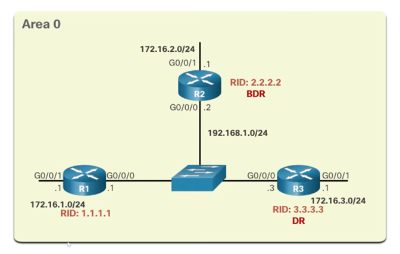
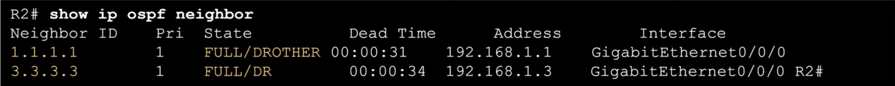
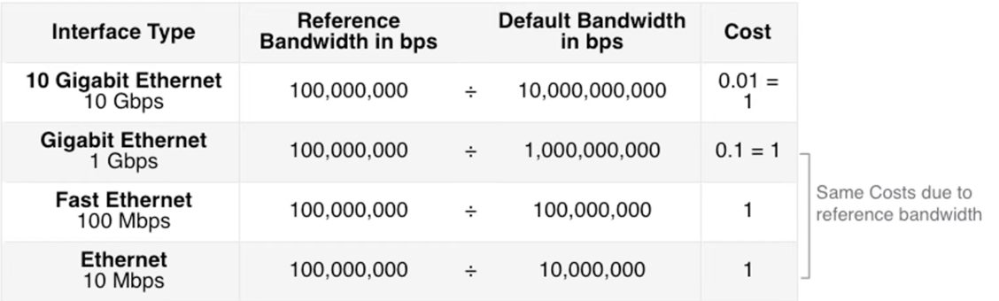
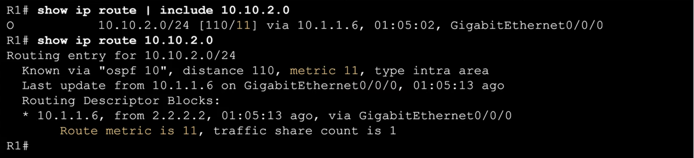

# OSPF Single-Area Router Configuration

## Basics of OSPF configuration
- The OSPFv2 is enabled using `router ospf process-id` command, where `process-id` is an integer from 1 to 65535. `process-id` is only locally significant.
> Best practice is to use the same `process-id` on all routers in the network to make management easy.


### Router ID
**Router ID** is a unique 32-bit number (formatted in the same way as IPv4 addresses) that identifies the router
in the OSPF domain. It is manually configured using the `router-id` command in the OSPF configuration mode.
> If not configured, the highest IP of any loopback interface is used, or IPv4 specifically configured on 
> any of the physical interfaces on the router is used as the router ID.

Router ID is used to elect the **DR** and **BDR** in multi-access networks. The router with the highest router ID
becomes the DR, and the router with the second-highest router ID becomes the BDR. These routers then manage the
synchronization of LSDBs with other routers in the network. Also, the router with the highest ID initiates DBD
packet exchange in Exchange state.

**Configuring a Loopback interface as the Router ID:**
- Enter an interface config mode `interface loopback 0`
- Configure the loopback IP address `ip address 1.1.1.1 255.255.255.255`

**Specifically configuring the Router ID:**
This is the preferred option.

- Enter the configuration mode.
- Enable OSPF using the `router ospf 10` command (process-id in this example is `10`).
- Set the router ID using the `router-id 1.1.1.1` command (router-id in this example is `1.1.1.1`).

> **Note:** If you are changing the router ID from some other previously configured value, it is necessary to clear the OSPF process using the `clear ip ospf process` command.

### Configuring OSPF network interfaces




After enabling the OSPF process, the next step is to configure the interfaces that will participate in the OSPF process.

- Enter the config-router mode using the `router ospf process-id` command.
- Use the `network` command to add all networks that we want to route using OSPF with `network network-address wildcard-mask area area-id` command.
- `network 10.10.1.0 0.0.0.255 area 0`
- `network 10.1.1.4 0.0.0.3 area 0`
- `network 10.1.1.12 0.0.0.3 area 0`

This adds the 3 network to the OSPF routing process (example for R1 from the scheme above).

> OSPF can also use exact interface IPv4 addresses instead of network addresses by using `0.0.0.0` wildcard mask.

> OSPF can also be configured directly from an interface
> - Enter the interface config mode using the `interface interface-type interface-number` command.
> - Use the `ip ospf process-id area area-id` command to enable OSPF on the interface.
> - For example: `interface g0/0/1`, `ip ospf 10 area 0`


### Passive interfaces

Passive interface does not send or receive OSPF Hello packets. Therefore, it does not form neighbour relationships with other routers on that interface.

- Enter the config-router mode using the `router ospf process-id` command.
- Use the `passive-interface interface-type interface-number` command to make the interface passive, for example `passive-interface g0/0/0`.
- To make all interfaces passive, use the `passive-interface default` command.

**`show ip protocols`** command can be used to check the list of interfaces configured as passive interfaces, alongside other OSPF configuration details.


### Point-to-Point OSPF networks
Even if there are only 2 routers on a network, DR and BDR are still elected by default. This can be avoided
by configuring the network as a point-to-point network.

- For each interface that is supposed to be point-to-point, enter the interface config mode.
- Use the `ip ospf network point-to-point` command to configure the interface as a point-to-point network.

### Multi-access OSPF networks
In multi-access networks, OSPF elects a DR and BDR to manage the synchronization of LSDBs with other routers in the network.

**Designated Router (DR)** is elected based on the highest ID. It uses multicast IPv4 address `224.0.0.5` to distribute the LSAs to all other routers 
in the network. It listens for communication on multicast address `224.0.0.6`.

**Backup Designated Router (BDR)** is the second-highest ID router in the network. It takes over the DR role if the DR fails. Same as DR, it listens for communication on multicast address `224.0.0.6`.

All the other routers are referred to as **DROTHER** routers. They use multicast address `224.0.0.6` to send OSPF packet to DR and BDR.


In this reference topology, R3 will be elected as the DR, because it has the highest router ID. R2 will be the BDR.

> To verify the adjacency status, use the `show ip ospf neighbor` command.
> `FULL/xyz` state means that the router is fully adjacent with the neighbour router. If the router is in any other state, there might be a problem with the network.
> The only exception is the `2WAY` state, which is normal for DR and BDR.
> 

### DR and BDR election
The router interface priority can be set using the `ip ospf priority priority` command in the interface config mode.
The priority can be set to a value from 0 to 255. After change, the OSPF process must be cleared using the `clear ip ospf process` command.

- The router with the highest OSPF priority is elected as the DR.
- If there are multiple routers with the same priority, the router with the highest router ID is elected as the DR.
> Default priority for all interfaces is 1. If the interface priority is set to 0, it cannot become the DR or BDR.


When DR fails, BDR is automatically promoted to DR. A new BDR is elected from the remaining routers.

> The addition of new router **DOES NOT** initiate a new DR/BDR election. The election is only triggered when the DR or BDR fails.


## OSPF Cost Calculation
The OSPF cost is calculated based on the bandwidth of the interface. The formula for calculating the cost is:
```
Cost = 100,000,000 / Bandwidth
```
... meaning the higher the bandwidth, the lower the cost.

Lowest cost means the best path.

> 
> **Note:** The default reference values create an issue causing the costs to be the same (values are rounded
> to the nearest integer, therefore 10 Gbps cost is rounded to 1...), therefore it is recommended to adjust it manually.

The reference bandwidth can be adjusted using the `auto-cost reference-bandwidth bandwidth` command in
the OSPF configuration mode. It does not affect the bandwidth itself, but rather the calculation of the cost based
on the bandwidth. For 10 Gbps bandwidth, we would usually set the reference bandwidth to 10000. The default value is 100
(originally it was designed for 100 Mbps as the highest possible speed).

It can also be manually set using the `ip ospf cost cost` command in the interface config mode. That is useful for example when
interfacing with non-Cisco routers that do not support the auto-cost calculation.

> **Note:** This adjustment to the calculation needs to be done on all routers in the OSPF domain to avoid routing issues.


**OSPF accumulates the cost of all links to calculate the best path.**

> 
> The total cost to reach a certain network can be verified using the `show ip route | include 10.10.2.0` command. The cost is displayed in the square brackets.
> The pipe is used to filter the output to only show the line with the desired network.

## Hello and Dead timers
By default, OSPF Hello packets are sent every 10 seconds on broadcast and point-to-point networks, and every 30 seconds
on NBMA networks. The Dead timer is 4 times the Hello timer, meaning 40 seconds on broadcast and point-to-point networks,
and 120 seconds on NBMA networks.

When the Dead timer expires, the router is declared dead and the neighbour relationship is removed. The router then floods
the LSDB with information about the dead router.

To change the Hello and Dead timers, use the `ip ospf hello-interval seconds` and `ip ospf dead-interval seconds` commands
in the interface config mode.
> The timer configuration of adjacent routers must match, otherwise the adjacency will not be established.


## Default route propagation
To propagate a default static route in the OSPF domain, use the `default-information originate` command in the OSPF
configuration mode. This command makes the router to advertise the default route to all OSPF routers in the domain and
should be configured on the edge router.


For example, to configure R2 in the first example topology as the edge router in the OSPF domain:
- Enter interface config mode using the `interface lo1` command.
- Assign IP address to the interface using the `ip address 64.100.0.1 255.255.255.252` command.
- Exit the interface config mode using the `exit` command.
- Add the default static route using the `ip route 0.0.0.0 0.0.0.0 lo1` command.
- Enable OSPF using the `router ospf 10` command.
- Make the default route available to all routers in the OSPF domain using the `default-information originate` command.
- Exit the OSPF configuration mode using the `exit` command.
> Note: When configuring static address, it is best to use next-hop IP address instead of the exit interface to avoid routing loops.
> However, in this example, the exit interface is used for simplicity.

## Debugging OSPF
The `show ip route ospf` command can be used to display the OSPF routing table. It shows the networks that are known to the router and the cost to reach them.

Other useful commands include:
- `show ip ospf neighbor` - displays the OSPF neighbours and their status.
- `show ip ospf interface` - displays the OSPF interfaces and their status.
- `show ip ospf` - displays the OSPF process information.
- `show ip protocols` - displays the OSPF configuration details.
- `show ip interface brief` - displays the IP addresses of all interfaces on the router.
- `show ip route` - displays the routing table.