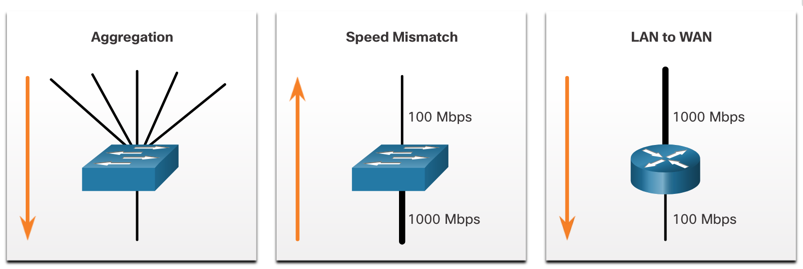
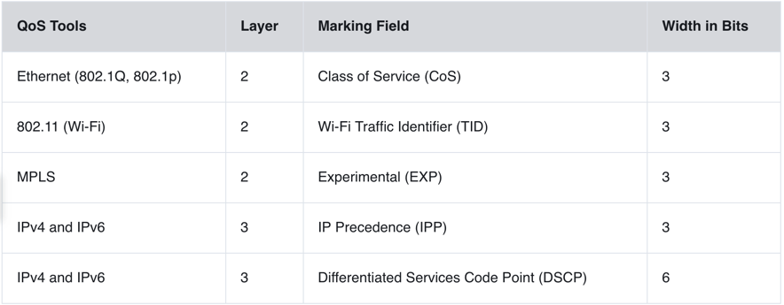
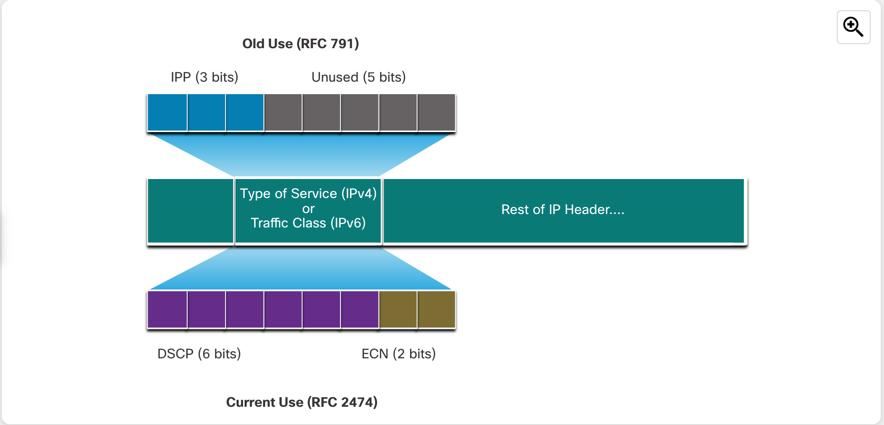
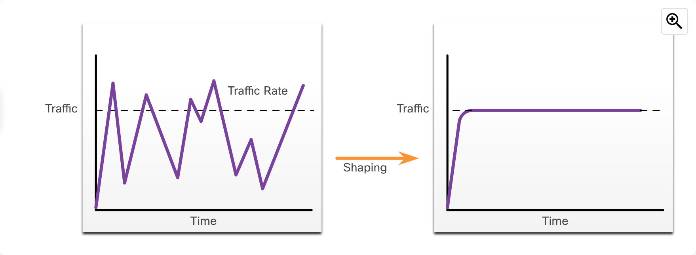
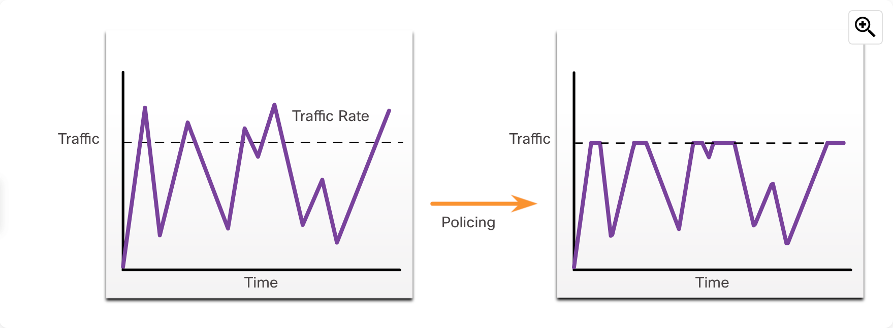

# QoS Concepts

Quality of Service is a technology that allows us to prioritize certain types of traffic over others at congestion points.

When volume of traffic is larger than the network capacity, packets are put into queue or dropped. By using QoS, we can control which packets
will be given priority and which will be delayed or dropped.

> **Congestion point examples:**
> 
> 

There can be various sources of delays: 
- Code delay - Time it takes to process the packet.
- Packetization delay - Time it takes to encapsulate the data into packets.
- Queueing delay - Time it takes for the packet to wait in the queue.
- Serialization delay - Time it takes to transmit the packet over the medium.
- Propagation delay - Time it takes for the signal to travel over the medium.
- De-jitter buffer delay - Time it takes to buffer the packets to remove jitter.

Without QOS, packets are processed in order. Delay in time-sensitive packets like VoIP (Voice over Phone) or RTP (Real-Time Protocol)
can cause bad experience. When router receives this messages, it has to compensate for the jitter that is encountered.

Time-sensitive packets are put into **playout delay buffer**, where they are reorganized and sent out in steady stream. If the jitter
is too large though, packets are discarded and dropouts can occur. Some of the dropouts can be compensated for by 
**DSP (Digital Signal Processing)** algorithms, that predict how the packets should look like and can fill smaller gaps.

### Traffic characteristics

**Voice traffic**
- Low bandwidth requirements, which is good.
- However, it is very sensitive to delay and jitter.

**Video traffic**
- High bandwidth requirements.
- Sensitive to delay and jitter.
- Requires less than 1% packet loss.

**Data traffic**
- Usually not as demanding, not sensitive to delay or jitter.
- We can divide it into **Mission-critical traffic** and **Non-critical traffic** and assign priorities based on that.

### QoS algorithms

- **FIFO (First In, First Out)** - Oldest packet is sent first. No prioritization.
- **WFQ (Weighted Fair Queuing)** - Packets are sent based on their weight. (Eg. Voice packets have higher weight than data packets.)
Not supported with tunneling and encryption.
- **CBWFQ (Class-Based Weighted Fair Queuing)** - Similar to WFQ, but allows to define classes of traffic and assign them priorities.
Allows to assign various metrics to the classes and how they are queued.
- **LLQ (Low Latency Queuing)** - Allows to define a strict priority queue for time-sensitive traffic. It is a part of CBWFQ. 

### QoS Models

- **Best-Effort** - No QoS, all packets are treated equally.
- **Integrated Services (IntServ)** - Each application can use signaling flags (RSVP) to request the QoS it needs. It is not scalable.
- **Differentiated Services (DiffServ)** - Packets are marked with a DSCP (Differentiated Services Code Point) in the IP header.
Routers can then use this marking to prioritize the packets. However, it is quite complex to set up. It is considered the most scalable.

### QoS Implementation techniques

Avoiding packet loss can be achieved by:

- Increasing link capacity
- Using the QoS algorithms
- Dropping low-priority packets before congestion occurs

**Classification and marking tools**

Sessions or flows are analyzed to determine what traffic class they belong to, and they are marked.

On L2 and L3, we can classify traffic based on interface they are coming from, ACLs and class maps. On L4-7, we can
use NBAR (Network-Based Application Recognition) to classify traffic based on the application.

Marking means appending a tag to the packet header, that tells the router how to treat the packet. It should be done
as close to source as possible. This establishes *trust boundary*. (Can be done at Layer 2 switches or Layer 3 switches/routers.)

> Traffic marking for QoS:
> 
> 
> 
> 

--- DSCP--- 

DSCP can have 3 main values:
- Best Effort (BE) - 000000
- Expedited Forward (EF) - 101110
- Assured Forwarding (AF) - 001010

**Congestion avoidance tools**

Traffic classes are allotted portions of network resources based on QoS policy.

Some congestion avoidance techniques provide preferential treatment for which packets will get dropped. For example, Cisco
IOS QoS includes weighted random early detection (WRED) as a possible congestion avoidance solution. The WRED algorithm
allows for congestion avoidance on network interfaces by providing buffer management and allowing TCP traffic to decrease,
or throttle back, before buffers are exhausted. Using WRED helps avoid tail drops and maximizes network use and TCP-based
application performance. There is no congestion avoidance for User Datagram Protocol (UDP)-based traffic, such as voice
traffic. In case of UDP-based traffic, methods such as queuing and compression techniques help to reduce and even prevent
UDP packet loss.

> **Traffic shaping vs Traffic policing**
> 
> 
> 
> Shaping = using a sufficient memory buffer to accommodate for the spikes in traffic by delaying the packets instead
> of dropping them completely. It is used outbound.
> 
> 
> 
> Policing = dropping the packets that exceed the defined rate. It is used inbound.

### General QoS Policy guidelines

- If possible, enable queuing on all devices between source and destinations.
- Classify and mark traffic as close to the source as possible.
- Shape and police traffic flows as close to the source as possible.