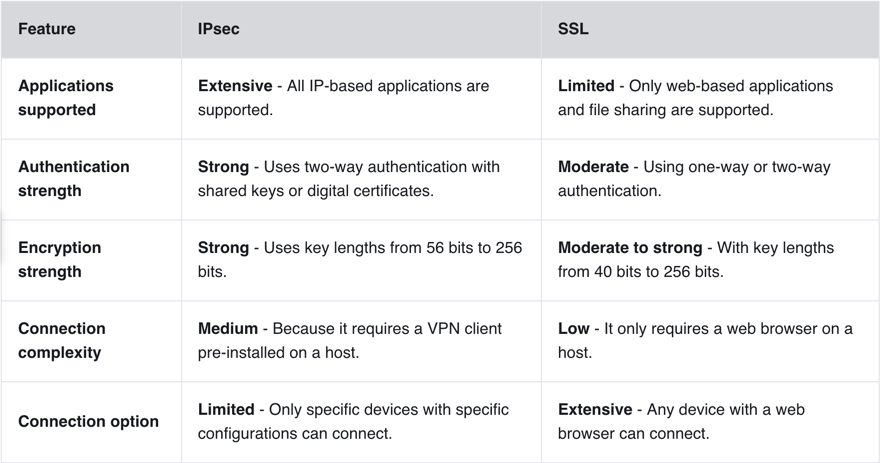
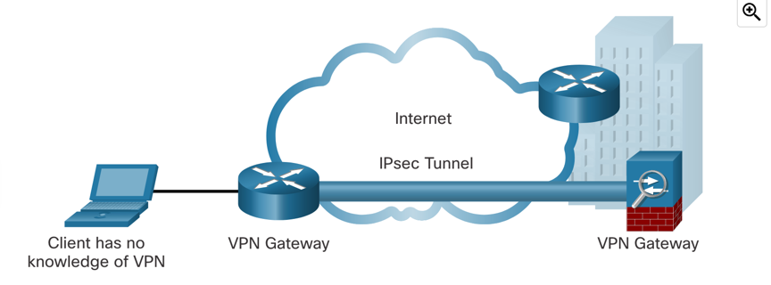
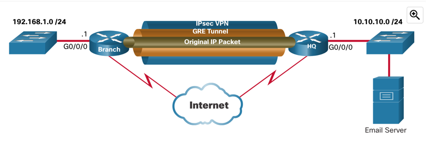
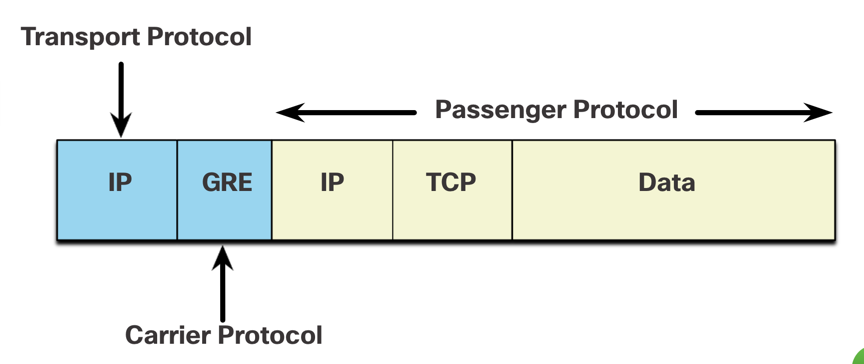
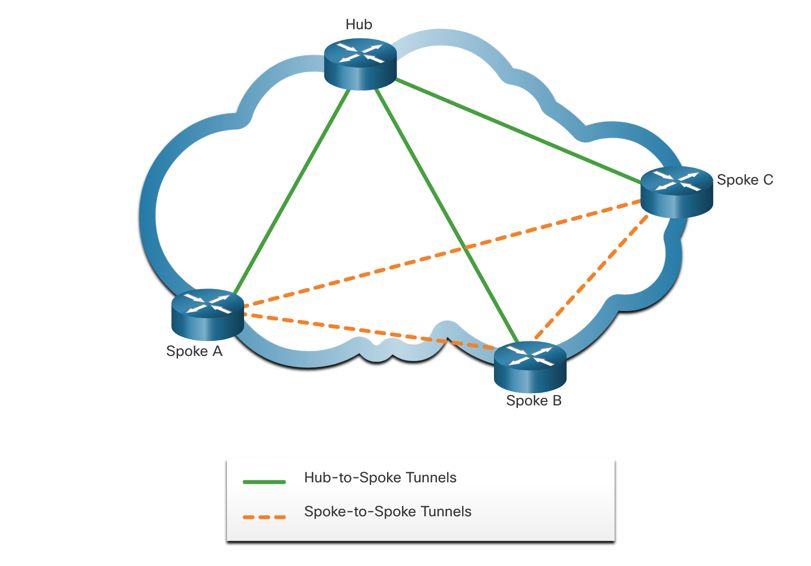
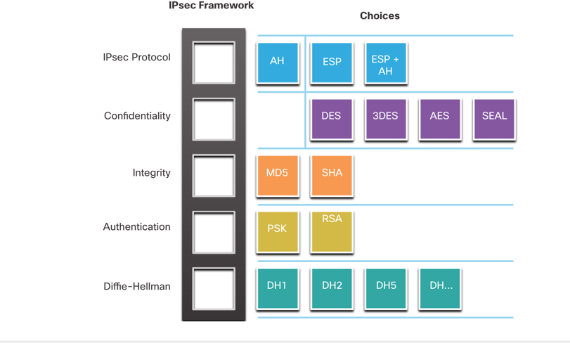

# VPN and IPsec Concepts

VPN (Virtual Private Network) is a technology that allows secure communication between two or more devices over a public network.
VPNs are used to create secure connections between remote sites, users, or devices.

- **Site-to-Site VPN** - Connects two or more sites over the internet. It is used to connect branch offices to the main office.
- **Remote Access VPN** - Connects remote users to the corporate network. It is used to provide secure access to employees working from home or on the road.

VPNs can be managed and deployed as:

- **Enterprise VPN** - Managed by the organization itself. (IPsec, SSL VPN, DMVPN)
- **Service Provider VPN** - Managed by a service provider. Usually uses MPLS at Layer 2 or 3.

### Types of VPN

- **SSL VPN (clientless)** - Uses SSL/TLS to create a secure connection. Operates at Web-based level. SSL uses public key infrastructure and digital certificates to authenticate the parties involved.
- **IPsec VPN (client based)** - Uses IPsec (Internet Protocol Security) to create a secure connection. IPsec operates at the network layer of the OSI model and provides encryption, authentication, and integrity.

> **Site-to-Site VPN using IPsec**
> 
> 

### GRE (Generic Routing Encapsulation)
It is a non-secure site-to-site tunneling protocol that can encapsulate a wide variety of network layer protocols inside
virtual point-to-point links over an IP network. It allows usage of multicast and broadcast traffic. (Eg. it can transport
routing updates etc. to create a "uniform virtual network" even when in different geographical locations.)

To secure GRE tunnels, IPsec can be used to encrypt the GRE traffic.s

> 
> 
> We can say that the original IPv4/6 packet is a **passenger protocol**, GRE is a **carrier protocol**, and IPsec
> (== IPv4 or IPv6 again) is a **transport protocol**.

### Dynamic multipoint VPN (DMVPN)

DMVPN is a Cisco software sulution for building multiple VPNs. It uses hub-adn-spoke topology, where the hub is the main
site and the spokes are the remote sites. It uses GRE tunnels to connect the spokes to the hub. DMVPN is dynamic, meaning
that the spokes don't need to have a direct tunnel to each other, they can communicate through the hub.

### MPLS VPN

Allows multiple VPNs to coexist on the same provider network. It uses MPLS to create a secure connection between sites and 
enables an enterprise to emulate an Ethernet multiaccess LAN with remote sites connecting to the provider edge.

## IPsec

IPsec is a set of frameworks and protocols that together provide security for IP traffic.

It operates on Layer 3 of the OSI model (and therefore protects all the upper 4-7 layers). 

It provides:

- Confidentiality - Data is encrypted.
- Integrity - Hashing to prove data was not tampered with.
- Origin authentication - Proves the origin of the data thanks to IKE (Internet Key Exchange) protocol.
- Diffie-Hellman key exchange - Secure key exchange protocol.

IPsec encapsulates packets using AH or ESP. The degree of confidentiality depends on the encryption algorithm and the length
of the key used in the encryption algorithm. The HMAC is an algorithm that guarantees the integrity of the message using a
hash value. The device on the other end of the VPN tunnel must be authenticated before the communication path is considered secure.
A PSK value is entered into each peer manually. The PSK is combined with other information to form the authentication key.
RSA authentication uses digital certificates to authenticate the peers. The local device derives a hash and encrypts it with
its private key. The encrypted hash is attached to the message and is forwarded to the remote end and acts like a signature.
DH provides a way for two peers to establish a shared secret key that only they know, even though they are communicating over an insecure channel.

*Take note of the following technologies on different layers (might be asked in the exam):*

**IPsec modes:**

- **Transport mode** - Only the payload of the IP packet is encrypted. The header is left intact.
- **Tunnel mode** - The entire IP packet is encrypted and encapsulated inside another IP packet.
