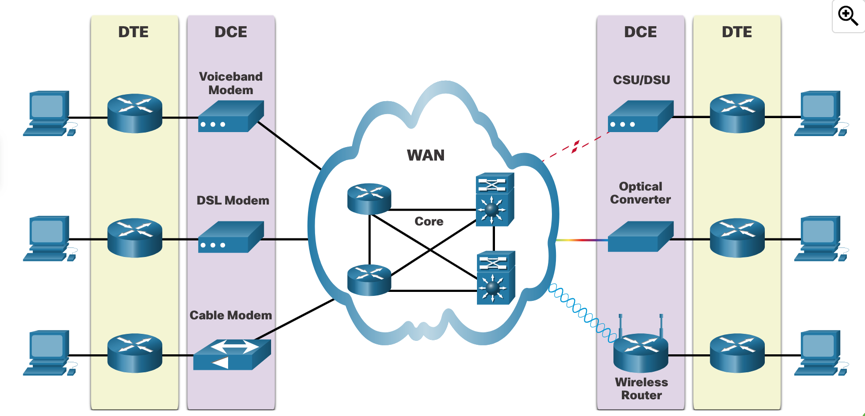

# WAN concepts

WAN = Wide Area Network, a network that covers a broad area, such as a city, country, or even intercontinental connections.

WAN networks are usually owned and managed by internet service providers for a fee. Their goal is to provide high bandwidth
speeds over long distances using complex physical networks.

### WAN topologies

- **Point-to-point** - Direct connection between two devices (sites).
- **Hub-and-spoke** - Central site (hub) connects to multiple remote sites (spokes).
- **Dual-homed** - Two routers connect to two different ISPs for redundancy.
- **Full mesh** - Every site connects to every other site.
- **Partial mesh** - Some sites connect to every other site.

When an organization connects to the internet, it negotiates a SLA (Service Level Agreement) with the ISP. The SLA defines the
level of service the organization can expect from the ISP. The service provider may not be the actual carrier.

Organizations can opt in for:

- Single-Carrier Service - One ISP provides the connectivity.
- Multi-Carrier Service - 2 or more ISPs provide the connectivity. The second one can often be used only as a backup.

**WAN standards** are mostly defined by:
- TIA (Telecommunications Industry Association)
- ISO (International Organization for Standardization)
- IEEE (Institute of Electrical and Electronics Engineers)

These standards focus mostly on L1 (Physical) and L2 (Data link) of the OSI model.

On L1, interesting are mainly optical fiber standards, like:
- **SDH (Synchronous Digital Hierarchy)** - Standard for synchronous data transmission on optical media. (Simple, uses lasers or LEDs.)
- **SONET (Synchronous Optical Network)** - Equivalent to SDH, but used in North America.
- **DWDM (Dense Wavelength Division Multiplexing)** - Multiplexing technique for increasing bandwidth over existing fiber optic backbones. Uses multiple wavelengths of light to transmit data simultaneously.

On L2, we have:
- **Broadband** - DLS, Cable
- **Ethernet** - Metro Ethernet, Carrier Ethernet
- **Wireless** - WiMAX, LTE
- **MPLS (Multiprotocol Label Switching)** - Protocol for speeding up and shaping network traffic flows.
- **PPP (Point-to-Point Protocol)** - Data link protocol used to establish a direct connection between two nodes.
- **HDLC (High-Level Data Link Control)** - Bit-oriented synchronous data link layer protocol.
- **Frame Relay** - Packet-switching technology that operates at the data link layer of the OSI model.
- **ATM (Asynchronous Transfer Mode)** - Connection-oriented technology that uses fixed-sized cells to transport data.

### WAN terminologies

- **Subscriber** - Person or organization that pays for the WAN service. (Their network is called **Enterprise Edge**)
- **Service Provider** - Provides WAN services to subscribers. (Their network is called **Provider Edge**)
- **DTE (Data Terminal Equipment)** - Device that connects subscriber to the WAN. (Router, switch, etc.)
- **DCE (Data Circuit-Terminating Equipment)** - Device that connects DTE to the WAN. (Modem, CSU/DSU, etc.)
- **CPE (Customer Premises Equipment)** - = DTE and DCE devices located on the enterprise edge. Can be leased or owned.

- **Point of Presence (POP)** - Physical location where the provider network connects to the subscriber network.
- **Demarcation Point** - Physical point where the provider network ends and the subscriber network begins.
- **Central Office (CO)** - Building where the provider houses the equipment to connect to the subscriber network.
- **Local Loop / Last mMile** - Connection between the subscriber and the CO.
- **Backhaul** - Connection between access nodes of the ISP, can span over large regions.
- **Backbone** - Huge high-capacity networks connecting multiple ISPs together.

> 

### Circuit switching vs Packet switching

- **Circuit switching** - Dedicated communication path is established between two devices. (Old telephone system)
- **Packet switching** - Data is divided into packets and sent over the network, without really creating a pre-defined route 
for the whole communication. (Internet)

---

### Legacy WAN technologies

Common WAN technologies:
- **Leased lines** - Dedicated connection between two sites. (T1, T3, E1, E3 -- T-Carrier = USA, E-Carrier in Europe).
Their speed is constant (mostly 1.5 Mbps for T1 and 43 Mbps for T3 links). They were simple and reliable, but expensive and did not provide good scaling.

Circuit-switched networks:
- **ISDN (Integrated Services Digital Network)** - Digital circuit-switched telephone network system. (BRI, PRI)
- **PSTN (Public Switched Telephone Network)** - Global network of public circuit-switched telephone networks.

Packet-switched networks:
- **Frame Relay** - Packet-switching technology that operates at the data link layer of the OSI model. (Used to be popular, but is now mostly replaced by MPLS.)
- **ATM (Asynchronous Transfer Mode)** - Connection-oriented technology that uses fixed-sized cells to transport data. (Also mostly replaced by MPLS.)

### Modern WAN technologies

**Ethernet WAN** - Uses Ethernet as the connection method. (Metro Ethernet, Carrier Ethernet, Ethernet over MPSL, VPLS). They provide
reduced expenses, better scalability, and easier management.

**MPLS** - Multiprotocol Label Switching. Protocol for speeding up and shaping network traffic flows. It is a technique that directs data from one network
node to the next based on short path labels rather than long network addresses, avoiding complex lookups in a routing table.

### Internet-Based Connectivity

**DLS (Digital Subscriber Line)** - Uses existing telephone lines to provide high-speed internet access. (ADSL, VDSL, SDSL).
The typical feature is asymmetric bandwidth (download speed is higher than upload speed). There is an area called POTS (Plain Old Telephone Service) that is not affected by DSL.

It is usually used in combination with PPP (Point-to-Point Protocol) for authentication and connection establishment and requires DSL modem that converts digital data (local network Ethernet) to analog signals.

**Cable Internet** - Uses the same coaxial cable that delivers cable television. Again, need a modem to convert signals. It is faster than DSL.

**Fiber Optic Internet** - Uses fiber optic cables to deliver data. It is the fastest and most reliable, but also the most expensive.

- FFTH (Fiber to the Home) - Fiber optic cable directly to the home.
- FFTB (Fiber to the Building) - Fiber optic cable to the building, curb... then copper to home.
- FTTN (Fiber to the Node) - Fiber optic cable to the neighborhood, then copper to the home.

**Wireless WAN** - Uses radio waves to provide connectivity. (WiMAX, LTE, 5G, Satellite). It is used in remote areas, or as a backup connection.

### ISP connectivity options

- **Single-Homed** - One ISP provides the connectivity. (Cheaper, but no redundancy.)
- **Dual-Homed** - Two connections to 1 ISP. (More expensive, but slightly more reliable.)
- **Multi-Homed** - 2 or more ISPs provide the connectivity. (More expensive, but more reliable.)
- **Dual Multi-Homed** - 2 connections to 2 ISPs. (Most expensive, but most reliable.)

